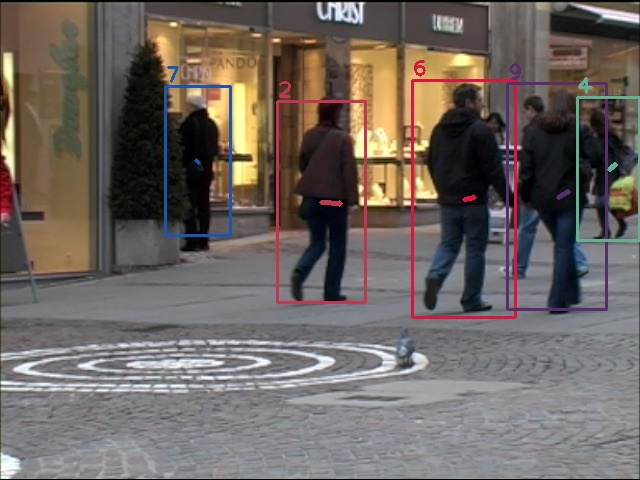

# sort-cpp


C++ implementation of SORT (Simple, online, and realtime tracking of multiple objects in a video sequence).

## introduction

SORT was initially described in [this paper](http://arxiv.org/abs/1602.00763) with the [python code](https://github.com/abewley/sort), this repo try to reproduce it by using C++.

## environment
* ubuntu 20.04 (gcc 9.4.0, cmake 3.16.3, c++ standard 17)
* [opencv 4.6.0](https://github.com/opencv/opencv/releases/tag/4.6.0)

## run
````shell
$ mkdir build && cd build
$ cmake ..
$ make
$ ./demo_sort [data folder]
// e.g. ./demo_sort ../data/TUD-Stadtmitte/
````
